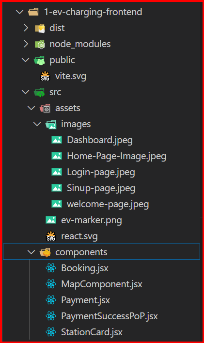
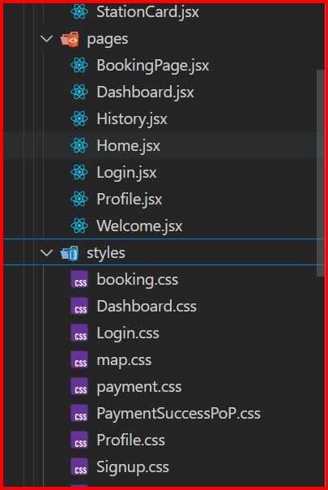
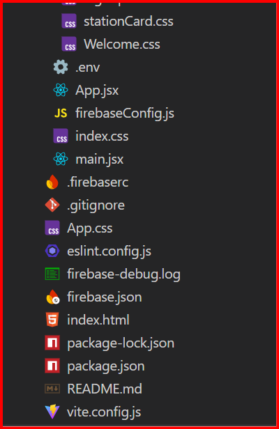
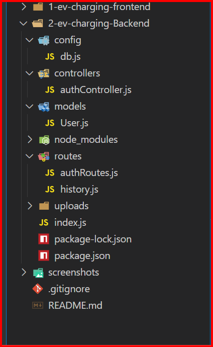
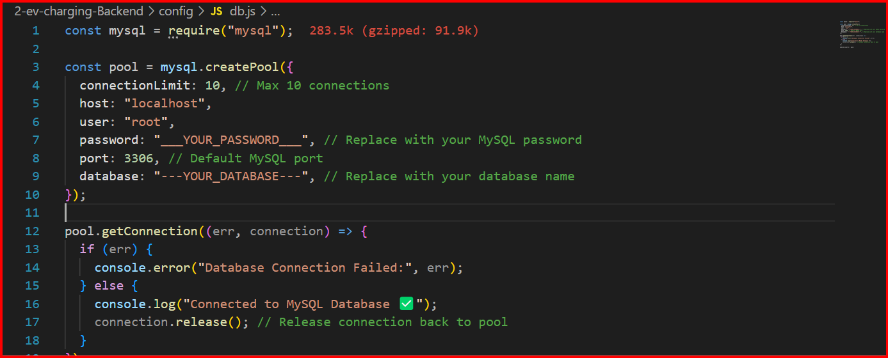

<<<<<<< HEAD
# ⚡ EV Charging Station Website

A modern, responsive **EV Charging Station web application** built with **React.js (Vite)**, **Bootstrap**, and **Node.js + Express + MySQL**.  
It allows users to **search EV stations, book charging slots, view booking history, manage profiles, and make secure payments**.

---

## 🚀 Features

### 🔹 User Features
- **Home Page** – Introduction and features.
- **Search & Book** – Find nearest EV stations using location search + Leaflet.js map.
- **Booking System** – Select charging slot, confirm booking, and pay online.
- **Payment Integration** – Razorpay for secure transactions.
- **User Profile** – View/update personal info.
- **Booking History** – See past charging sessions.
- **Mobile Friendly** – Fully responsive UI.

### 🔹 Admin Features (Optional)
- Add/Edit/Delete EV stations.
- Manage bookings and payments.
- View analytics dashboard.

---

## 🛠 Tech Stack

### **Frontend**
- [React.js (Vite)](https://vitejs.dev/)
- [Bootstrap](https://getbootstrap.com/)
- [Leaflet.js](https://leafletjs.com/) – Maps
- [Axios](https://axios-http.com/) – API calls

### **Backend**
- [Node.js](https://nodejs.org/)
- [Express.js](https://expressjs.com/)
- [MySQL](https://www.mysql.com/)
- [Razorpay](https://razorpay.com/) – Payments

---

## ⚙️ Installation & Setup  
### Setup Mysql 
### MySQL Database Setup

CREATE DATABASE ev_charging_db;
Create users table:

-- 1️⃣ Bookings Table
CREATE TABLE bookings (
  booking_id INT NOT NULL AUTO_INCREMENT PRIMARY KEY,
  user_id INT NOT NULL,
  station_name VARCHAR(255) NOT NULL,
  station_address VARCHAR(255) NOT NULL,
  booking_date DATE NOT NULL,
  booking_time TIME NOT NULL,
  price DECIMAL(10,2) NOT NULL,
  created_at TIMESTAMP DEFAULT CURRENT_TIMESTAMP,
  user_name VARCHAR(255) NOT NULL
);

-- 2️⃣ Payments Table
CREATE TABLE payments (
  payment_id INT NOT NULL AUTO_INCREMENT PRIMARY KEY,
  booking_id INT NOT NULL,
  user_id INT NOT NULL,
  card_number VARCHAR(16) NOT NULL,
  expiry VARCHAR(5) NOT NULL,
  cvv VARCHAR(4) NOT NULL,
  amount_paid DECIMAL(10,2) NOT NULL,
  payment_status ENUM('pending','success','failed') DEFAULT 'pending',
  created_at TIMESTAMP DEFAULT CURRENT_TIMESTAMP
);
-- 3️⃣ Users Table
CREATE TABLE users (
  user_id INT NOT NULL AUTO_INCREMENT PRIMARY KEY,
  full_name VARCHAR(255) NOT NULL,
  email VARCHAR(255) NOT NULL UNIQUE,
  phone VARCHAR(20) DEFAULT NULL,
  profile_image VARCHAR(255) DEFAULT NULL,
  password_hash VARCHAR(255) DEFAULT NULL,
  google_id VARCHAR(255) UNIQUE DEFAULT NULL,
  created_at TIMESTAMP DEFAULT CURRENT_TIMESTAMP
);

### Setup Frontend

cd 1-ev-charging-frontend
npm install  
npm install @fortawesome/fontawesome-svg-core @fortawesome/free-brands-svg-icons @fortawesome/free-regular-svg-icons @fortawesome/free-solid-svg-icons @fortawesome/react-fontawesome @react-google-maps/api @stripe/react-stripe-js @stripe/stripe-js @tailwindcss/vite animate.css axios bootstrap esbuild firebase framer-motion leaflet moment razorpay react react-bootstrap react-datepicker react-dom react-icons react-leaflet react-router-dom stripe
## 📂 Folder Structure
### Frontend

## Run the Frontend
npm run dev

## Setup Backend

cd 2-ev-charging-Backend
npm install  
npm install bcryptjs body-parser cors dotenv express firebase-admin jsonwebtoken multer mysql mysql2 path  
## 📂 Folder Structure

### changes the backend password and databases name

## Run the Backend  

node index.js  
nodemon index.js

---

